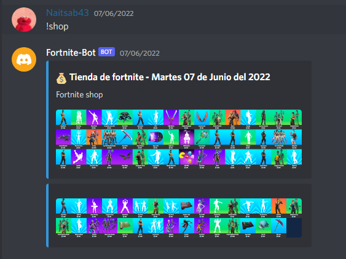

# Fortnite shop bot

The bot needs to be run in a discord server.

## Configuration

  * The bots need some configuration to work. A file name **config.py** with the following content:

  ```
  BOT_TOKEN = * Here token of your bot *
  ```

## Commands

  * Shop: `!shop`

    